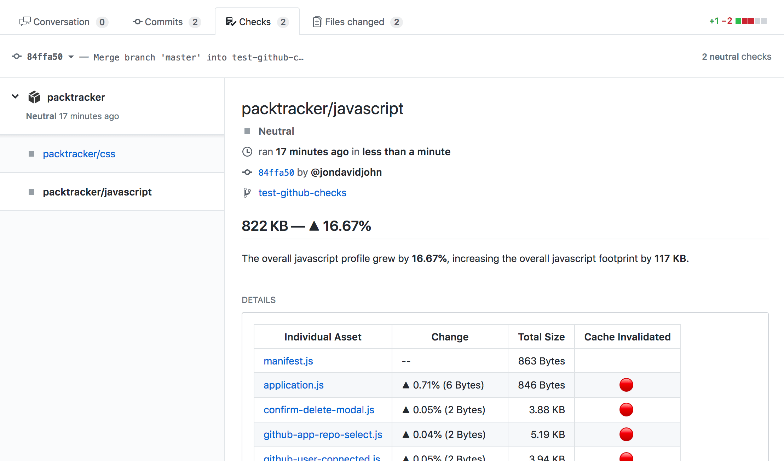

# GitHub Pull Request Checks

## A note on using automation

In order for this integration to run smoothly, we assume you are using a CI/CD service to perform your webpack build and [report your build stats](https://docs.packtracker.io/uploading-your-webpack-stats).

If you are not utilizing a CI environment to run your webpack builds and report your stats, we suggest starting there first.  Integrating your project with a provider that runs your build every time you push, provides a consistent basis to perform these checks.

Make sure you're uploading your stats for every push, not only pull requests.  We need stats for both the last commit of the branch you're merging into, as well as the head of the pull request branch in order to provide you with details of the difference between the two.

## Setting up GitHub Checks

### Connecting to GitHub

First visit the **"GitHub Checks"** tab from your project overview page. 

From there you should see an option to connect your user account with your GitHub user account.  Once you complete this process, you will then see the option to select which repository you want us to report Checks to.

Initially you will not see any repositories because you have not installed our GitHub App yet.  When you open the repository drop down you should see a link suggesting that you install our GitHub App.  While installing our GitHub App, be sure to provide us with access to the repository you ware wanting to attach to your packtracker project.

Once you have installed the app and selected it from the dropdown, save your project settings.  This should get webhooks flowing.

### When does it report?

We will report asset changes on all your pull requests, taking a previously calculated base commit and comparing it with the latest commit on your pull request.

Once you open and/or push to a pull request, you should see our in progress checks show up.  Once we have calculated your stats for both the base and latest commit on your branch, they will show up as completed.

