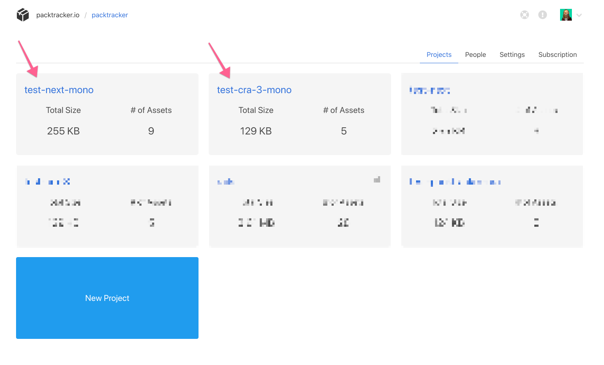
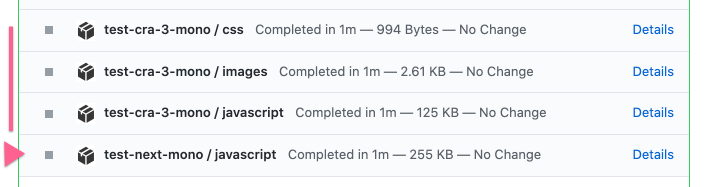

# Multi-project repositories


First and foremost, you should begin by [setting up a single project.](../uploading-your-webpack-stats/)

This will give you the experience and understanding of how to report your webpack build stats to us.  The rest of this documentation will assume you have done this, and will outline the additional steps needed to set you the other projects you have in your repository.


### One packtracker.io project for every webpack project

The first step in this process will be to create a project on packtracker.io for every webpack project you wish to track.  For example, **if you have 3 different projects** in your repository, **you need to have 3 separate projects** on packtracker.io.

Once you have these projects set up, you will need to retrieve the **project token** for each project you wish to report on.

### Reporting

Then, you will configure each additional webpack build \(**per project**\) using the project tokens of each project.  You have done this once before with your initial project, you should simply need to repeat these steps.

For illustration, [in my example repository](https://github.com/packtracker/monorepo-test/blob/master/.github/workflows/push.yml), I'm passing unique `PT_PROJECT_TOKEN` environment variables to each build, using independent secrets configured in GitHub.

Additionally, you may also need to specify each project's root directory if you are using our automated stat reporter \(like GitHub Actions or the CircleCI Orb\).  
  
Once you have correctly set up reporting for each project using the project tokens, you are all done.

### GitHub Checks

If you have done everything correctly, you should see multiple projects report their GitHub Checks successfully

### Example Repository

You can see an example configuration and pull request here:

[https://github.com/packtracker/monorepo-test](https://github.com/packtracker/monorepo-test)

