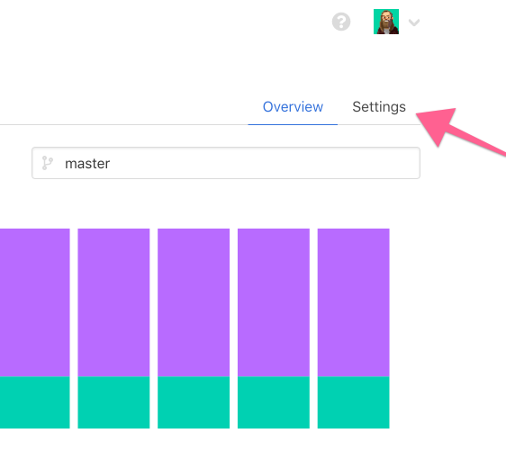
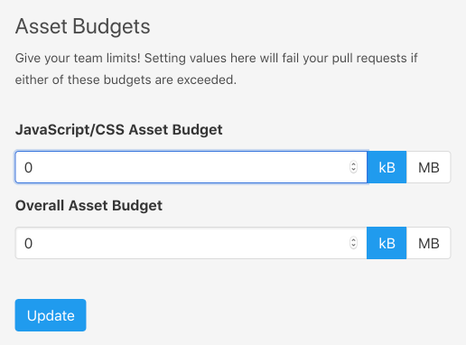

# Performance Budgets

As part of our Github Checks integration, you can set up performance budgets for both your **total asset output size** and on a **per asset basis**.

This means you can have both an upper limit for your total asset footprint, and also make sure your individual assets are beneath the threshold you configure.  When either of these limits are exceeded, we will fail the offending pull request with detailed information.

### Setting up your performance budgets

Performance budgets can be configured within the Project settings.

A budget of 0 will disable the budget checks.

