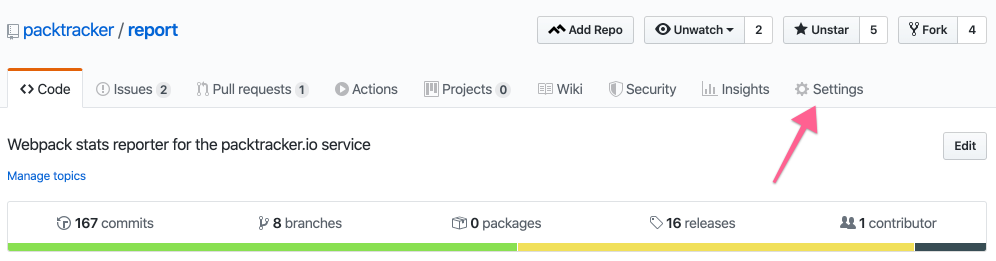
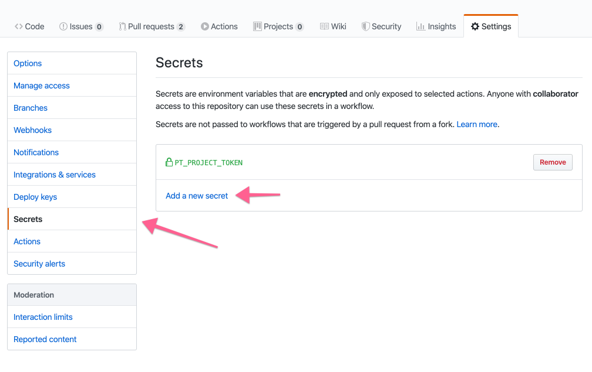

# GitHub Action

### Add your workflow

By far the simplest way to send us your build stats is to utilize [our GitHub Action](https://github.com/packtracker/github-action).

You _can_ set this up in GitHub Actions UI, or you can use the following workflow to get started quickly in your `.github/workflows/push.yml`

```text
on: push
name: packtracker.io
jobs:
  report:
    name: report webpack stats
    runs-on: ubuntu-latest
    steps:
    - uses: actions/checkout@master
    - name: report webpack stats
      uses: packtracker/report@2.2.7
      env:
        PT_PROJECT_TOKEN: ${{ secrets.PT_PROJECT_TOKEN }}
        WEBPACK_CONFIG_PATH: ./config/webpack/production.js

```

### Add your project token

You will also need to add your project token as a secret.





